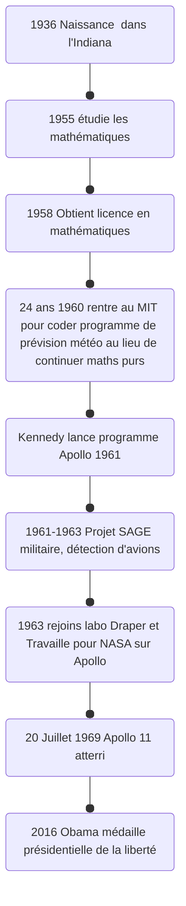

Aterrissage et navigation ordinateur embarqué, cartes perforés, premier ordinatueur portable.
Plein d'erreurs a l'aterissage mais vu que bien programmé peut prendre en premier les tâches les plus importantes et donc l'aterrissage est géré en premier.