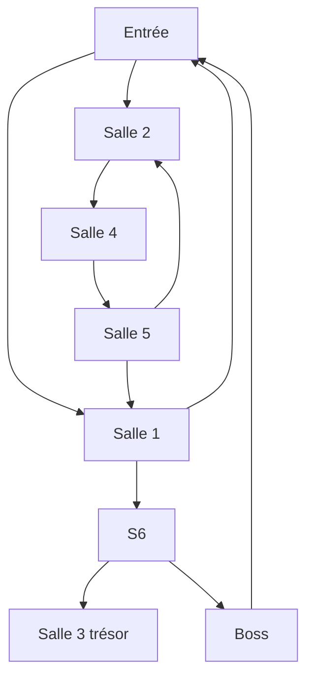
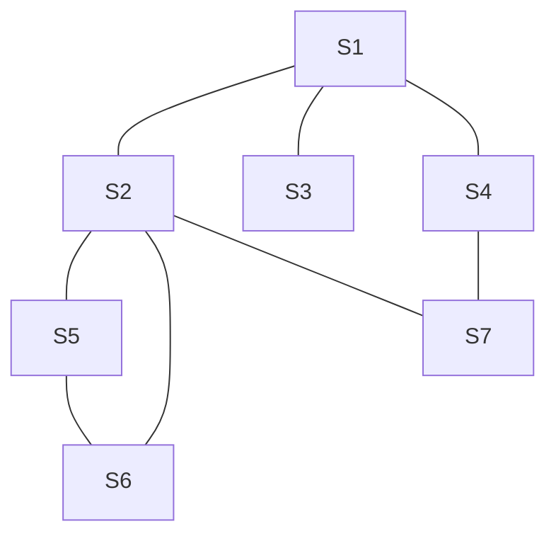
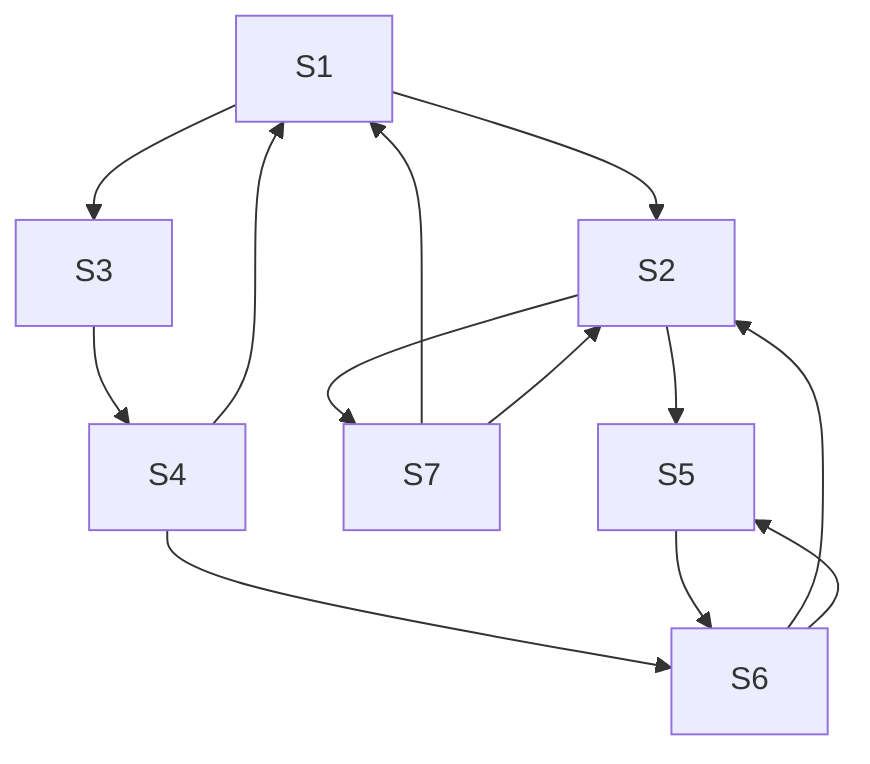
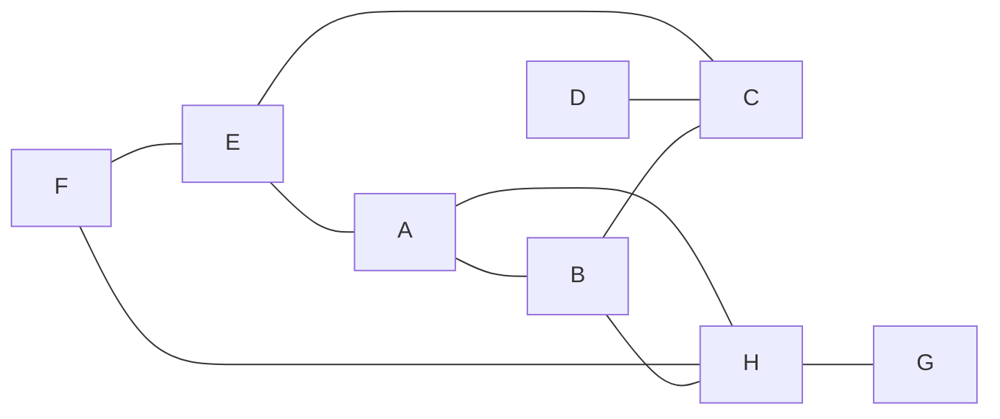
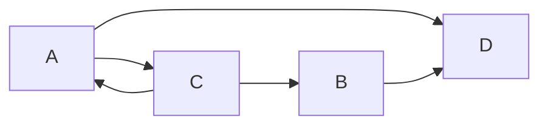
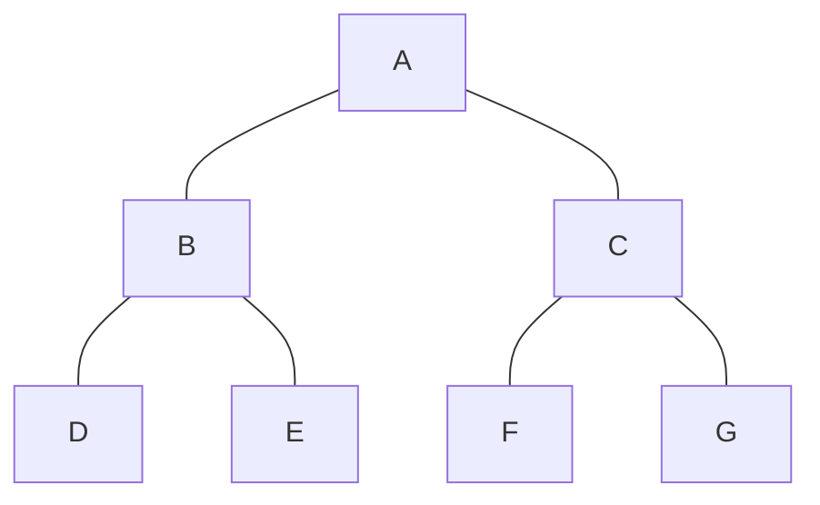
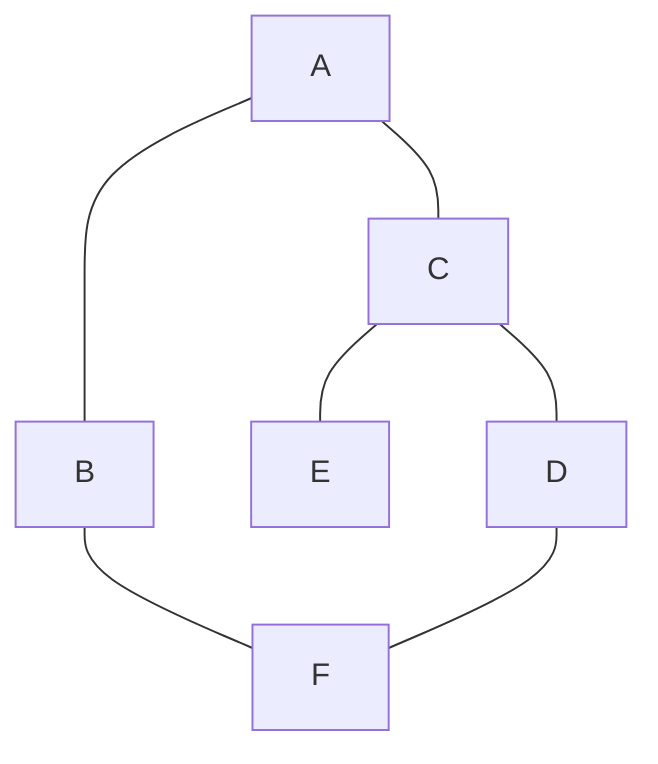

<b><u> Exercice 2</u></b>

 

<b><u> Exercice 3</u></b>

1.

2.

 

<b><u> Exercice 4</u></b>

1.

2.

 

<b><u> Exercice 5</u></b>

1.

2. Il me fait penser aux arbres binaires (vu précédéments) [[TP05 - arbres.pdf|TP05 sur les arbres]]

 

<b><u> Exercice 6</u></b>

Algorithme : 
- On retire un sommet de la pile qui deveint "le sommet courant"
	- SommetCourant : C, Contenu pile : []
- On affiche le commet 
	- (C)
- On empile les voisins de C dans la pile **s'ils n'ont pas déjà été colorié** (donc aucun)
	- Contenu pile : []. La pile est vide, on sort donc de la boucle  

#graphG

1. 
Courant | Pile | Colorié | Affiché
:-:|:-:|:-:|:-:
 || A | A |
A| B,C | A,B,C | A
C| B,E,D | A,B,C,E,D | C
D| B,E,F | A,B,C,D,E,F | D
F| B,E |---| F
E| B |---| E 
B| x |---| B
 

<b><u> Exercice 7</u></b>

#graphG 
- On ajoute D à la liste "chemin"
- Chemin : [A,C,D]
- Pour chauqe voison de A, si le voisin n'est pas déjà dans le chemin :
	- **On regarde si il existe un chemin allant du voisin à F** 
	- Si il existe  un chemin, on le retourne
- Si on sort de la boucle, on n'a pas trouvé de chemin, on retire le sommet du Chemin

Appel (Fonction) | Courant | Chemin | Voisins (aléatoire) 
-|:-:|-|-
Chemin(E,B)| E | [E] | C
Chemin(C,B)| C | [E,C] | A,D
Chemin(D,B)| D | [E,C,D] | F
Chemin(F,B)| F | [E,C,D,F] | B
Chemin(B,B)| B | [E,C,D,F,B] | 
